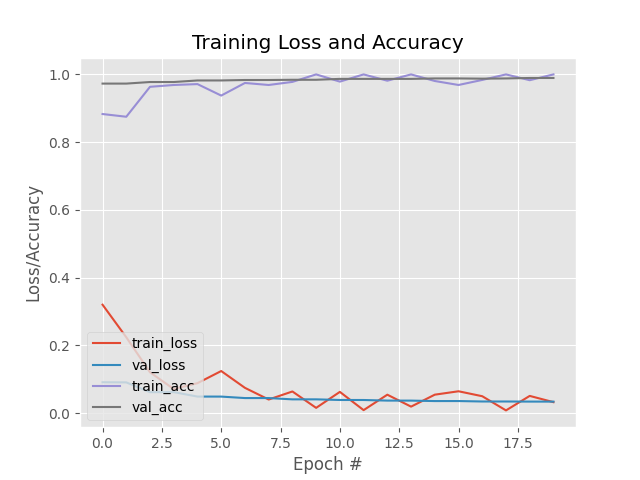

# Face Mask Detection with Temperature Sensor and Gate Control

## 📌 Overview
This project detects whether a person is wearing a mask using a **deep learning model** and a **real-time camera feed**.  
It also integrates with a **temperature sensor** and **gate control system** for automated access management.

---

## ✨ Features
- Real-time face mask detection using a CNN model.
- Face detection via OpenCV's Deep Learning-based SSD.
- Temperature measurement via sensor integration.
- Automatic gate control based on mask status and temperature.
- High accuracy (99% on validation set).
- Easy to train and customize with your own dataset.

---

## 📂 Project Structure
```
├── dataset/                # Images for training/testing (not included in repo)
├── models/                 # Pretrained models
│   ├── mask_detector.h5    # Trained mask detector model
│   └── face_detector/      # Face detection model files
│       ├── deploy.prototxt
│       └── res10_300x300_ssd_iter_140000.caffemodel
├── detection.py            # Mask detection script
├── gate_control.py         # Gate control logic
├── main.py                 # Main integration script
├── temperature_sensor.py   # Reads temperature from sensor
├── train_mask_detector.py  # Script to train the mask detector
├── utils.py                # Helper functions
├── plot.png                # Training loss/accuracy plot
├── requirements.txt        # Python dependencies
├── LICENSE                 # License file (MIT)
├── .gitignore              # Git ignore rules
└── README.md               # Project documentation
```

---

## ⚙️ Installation

1. **Clone the repository**
```bash
git clone https://github.com/YOUR_USERNAME/YOUR_REPO.git
cd YOUR_REPO
```

2. **Create a virtual environment** (optional but recommended)
```bash
python -m venv venv
source venv/bin/activate  # Linux/Mac
venv\Scripts\activate     # Windows
```

3. **Install dependencies**
```bash
pip install -r requirements.txt
```

---

## 📦 Models

### Face Detector Model
Download the files from OpenCV GitHub:
```bash
wget https://raw.githubusercontent.com/opencv/opencv/master/samples/dnn/face_detector/deploy.prototxt
wget https://github.com/opencv/opencv_3rdparty/raw/dnn_samples_face_detector_20170830/res10_300x300_ssd_iter_140000.caffemodel
```

### Mask Detector Model
Train your own model using:
```bash
python train_mask_detector.py
```

---

## 🚀 Usage

**Run mask detection only:**
```bash
python detection.py
```

**Run full system with temperature sensor & gate:**
```bash
python main.py
```

**Train your own model:**
```bash
python train_mask_detector.py
```

---

## 📊 Training Results


---

## 📜 License
This project is licensed under the MIT License - see the [LICENSE](LICENSE) file for details.

---

## 🙌 Acknowledgements
- [OpenCV](https://opencv.org/)
- [Keras](https://keras.io/)
- [TensorFlow](https://www.tensorflow.org/)
- Dataset sources from various public mask datasets.
